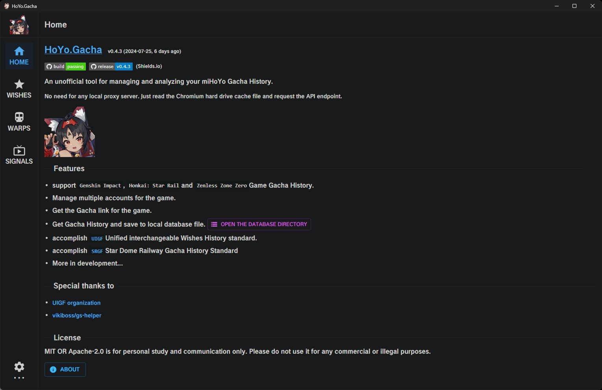

# HoYo.Gacha.DarkEN Edition

[HoYo.Gacha](https://github.com/lgou2w/HoYo.Gacha) - monkey-patched to provide auto-translations from `zh` to `en` + a **dark UI**!



## Features

- [HoYo.Gacha](https://github.com/lgou2w/HoYo.Gacha) - App providing analysis on gacha records, translated to `EN` using [translate-shell](https://github.com/soimort/translate-shell)
- Dark Mode UI! *(using [Dark Reader](https://github.com/darkreader/darkreader))*
- Update Compatible! *(any future [HoYo.Gacha](https://github.com/lgou2w/HoYo.Gacha) versions should mostly be compatible, since this is just monkey-patching the app so that it essentially runs it through Google Translate)*

## Runtime Requirements

- requires [translate-shell](https://github.com/soimort/translate-shell), i.e. `trans` command, to be installed and on your `PATH`.
- [translate-shell](https://github.com/soimort/translate-shell) is essentially an `awk` (GNU) script, which means a UNIX environment or [WSL](https://learn.microsoft.com/en-us/windows/wsl/install) is also required.
- follow [translate-shell](https://github.com/soimort/translate-shell)'s README to install for your system or just drop the [trans](bin/trans) script included in this repo into a directory that is on your `PATH`.
- additionally if on Windows, [WSL](https://learn.microsoft.com/en-us/windows/wsl/install) needs to be installed and `bin/trans.exe` and `bin/trans.shim` (from this repo) needs to be added to your Windows' `PATH`.

## Building

requires: **unix/wsl** environment with [pnpm](https://github.com/pnpm/pnpm) installed.

1. clone this repo - `git clone https://github.com/strawhat-dev/HoYo.Gacha.DarkEN.git`
2. navigate to repo directory - `cd HoYo.Gacha.DarkEN`
3. init `HoYo.Gacha` submodule - `git submodule update --init --remote`
4. use `./pnpm` from repo root directory in place of `pnpm` to run scripts with patches applied. _e.g._

```sh
./pnpm install         # install dependencies
./pnpm run tauri:build # build patched app
```

### Special Thanks

- [@lgou2w](https://github.com/lgou2w) for original [HoYo.Gacha](https://github.com/lgou2w/HoYo.Gacha) App!
- [translate-shell](https://github.com/soimort/translate-shell) cli app, for providing a way to utilize unlimited translations without usage of API key!
